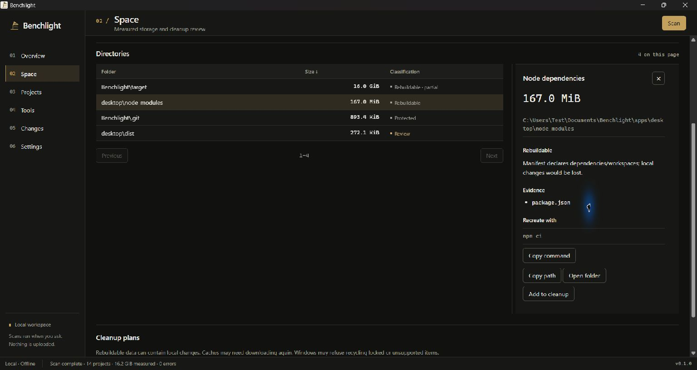
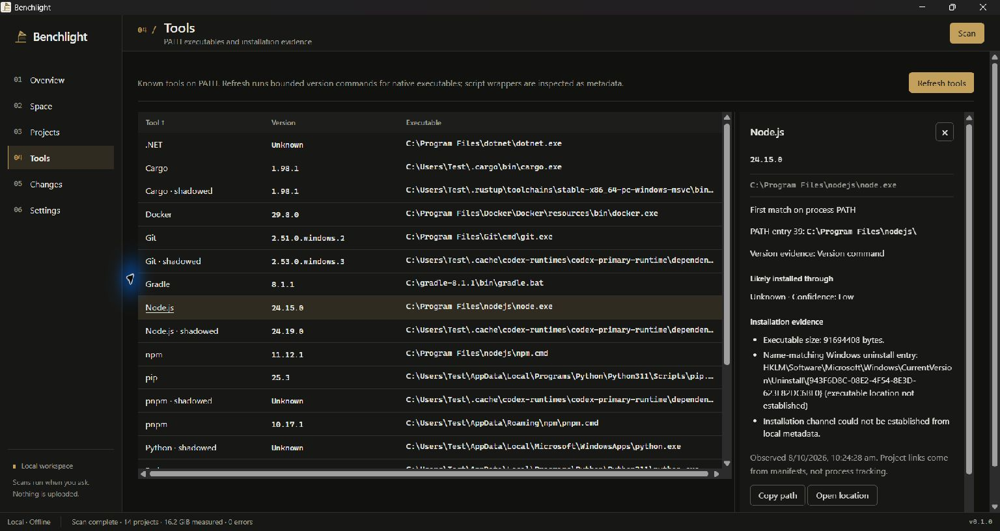
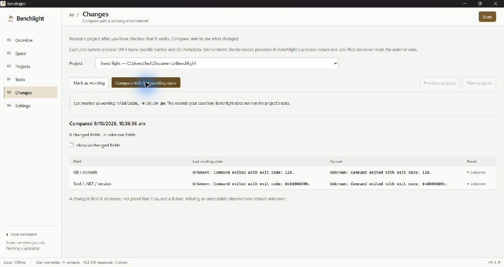

# Benchlight

[](https://github.com/Rhythm-Sanghi/Benchlight/actions/workflows/check.yml)

Benchlight is a Windows utility for understanding developer disk usage, installed
tools, and what changed since a project last worked. The desktop and CLI share a
Rust core and local SQLite database. No account, cloud service, AI model, telemetry,
or runtime internet connection is required.

Version 0.1.0 is an early release for Windows 11 x86-64. Nothing scans on
launch. Select project folders and start a scan yourself.

## Use it

Download `Benchlight_0.1.0_x64-setup.exe` from
[Releases](https://github.com/Rhythm-Sanghi/Benchlight/releases), or build it below.
The early release is unsigned; code signing is not configured. The installer expects
WebView2 already installed and downloads nothing. The default directory is
`%LOCALAPPDATA%\Benchlight`. It includes `benchlight-desktop.exe`, `benchlight.exe`,
the GPL license and dependency notices. It does not modify PATH. Uninstall
preserves the local database.

- **Space:** logical sizes, generated-directory evidence, conservative
  Rebuildable/Cache/Review/Protected classifications and explicit cleanup plans.
- **Projects:** manifest and Git discovery, sortable paginated rows and evidence.
- **Tools:** active and shadowed PATH executables, bounded version probes, local
  installation evidence and confidence. Unproven origins remain Unknown.
- **Changes:** immutable working snapshots and comparisons of tool paths/versions,
  lockfile hashes, Git metadata, runtime declarations and environment presence.
- **Settings:** selected roots, optional standard cache scope, exclusions,
  light/dark/system appearance and manual local log export.

Sizes are logical file lengths, not promised recovered bytes. Nested project totals
can overlap. Partial measurements remain marked. Cleanup requires review,
revalidation and an exact confirmation. Only eligible, complete directories on
local fixed NTFS drives can be recycled. There is no permanent-delete fallback.
Recycled data consumes disk space until you empty the Recycle Bin yourself.
Restored items have staging names; logs retain original paths. Read
[cleanup and recovery](docs/cleanup.md) before using it.

## Screenshots

Actual Windows release windows using this repository and this machine's PATH with
isolated metadata. Fixture projects are checked-in test directories discovered by
the scan, not prepopulated application data.

The existing desktop UI uses [Workshop Grid](docs/workshop-grid.md): compact
work areas, ruled tables, semantic light/dark tokens and resizable inspectors.
These screenshots show the rebuilt 2026-10-08 frontend.





## CLI

Desktop and CLI share `%LOCALAPPDATA%\Benchlight\benchlight.db` by default.
Use `--data-dir` for an isolated database. Examples after installation:

```powershell
$benchlight = "$env:LOCALAPPDATA\Benchlight\benchlight.exe"
& $benchlight roots add C:\Users\you\source
& $benchlight scan
& $benchlight projects --json
& $benchlight space --json
& $benchlight tools --refresh --json
& $benchlight inspect node --json
& $benchlight tool-projects node --json
& $benchlight mark-good C:\Users\you\source\project
& $benchlight changes C:\Users\you\source\project --json
& $benchlight status C:\Users\you\source\project --json
& $benchlight export-logs C:\Users\you\Documents\benchlight-logs.json
```

`scan-errors`, `working-state`, root removal/listing, `cache-scan` and `exclusions`
are also available. `projects` and `space` accept `--offset` and `--limit` (up to
200). Run `--help` or `<command> --help` for exact arguments.

Cleanup CLI sequence: `cleanup plan <directories...>`, `cleanup show <id>`,
`cleanup validate <id>`, then `cleanup apply <id> --confirm "RECYCLE <id>"`.
`cleanup log <id>` shows recorded outcomes. Changed data can invalidate a plan;
rescan and review a new plan in that case.

`mark-good` records your assertion that the project works. Optional
`--health-executable <absolute-native.exe> --health-arg <argument>` runs only the
command you explicitly provide, with time/output bounds. Failure prevents a new
baseline. Comparisons never rerun it. No project scripts run automatically.

Exit codes: 0 success, 1 operation failure, 2 invalid arguments, 3 partial scan or
cleanup result, 130 scan cancelled with Ctrl+C. `--json`, `--quiet` and `--no-color`
are global flags; output uses no ANSI colors.

## Build and check

Install stable Rust, Visual Studio C++ build tools with the Windows SDK, Node 24
LTS and WebView2. Initial dependency downloads require internet. Installed
Benchlight uses bundled assets and local operations.

```powershell
cd apps/desktop
npm ci
npm run tauri dev
```

From the repository root:

```powershell
./scripts/check.ps1
cd apps/desktop
npm run tauri build
```

Tauri commands prepare the CLI sidecar automatically. For direct fresh workspace
Cargo checks, run `scripts/cli-sidecar.ps1` first. Release output is in
`target/release/bundle/nsis`; `scripts/source-archive.ps1` creates a matching source
archive. Release builds regenerate dependency notices from locked dependencies.
`scripts/test-installer.ps1 -Installer <setup.exe>` tests an isolated installation,
same-version reinstall and uninstall; it refuses to replace an existing user
installation. See [CONTRIBUTING.md](CONTRIBUTING.md).

Found a bug? [Open an issue](https://github.com/Rhythm-Sanghi/Benchlight/issues)
with your Windows version, steps to reproduce and expected behavior. Remove
private paths and project information from logs before sharing them. Report
security problems privately as described in [SECURITY.md](SECURITY.md).

Verified checks: formatting, Clippy with warnings denied, 36 Rust tests, frontend
formatting/lint/typecheck, 20 frontend tests, 80 text-contrast checks and production build. Native release
screens, fixture recycling, installer lifecycle and WebView outbound-blocked
operation were reviewed on Windows. Windows CI runs on GitHub Actions. Different-version
installer upgrades and live OneDrive/removable-drive cases remain unverified.

## Scope and limits

No watcher or background cleanup runs. Scans skip links and nonresident cloud
placeholders; new network/mapped-drive roots are rejected. Cancellation waits for
an in-flight Windows read. Tool observations describe the Benchlight process PATH,
not shell aliases or every repository's runtime manager. Version probes are
bounded but are not a sandbox for malicious installed executables.

Docker engine accounting, arbitrary custom cache locations and workspace-inherited
Cargo constraint resolution are not implemented. Docker/WSL virtual disks are
reported conservatively. Snapshots do not read `.env` or store environment values;
a changed value with unchanged presence cannot be detected. Comparisons report
observed differences without claiming they caused a failure.

Details: [scanner](docs/scanner.md), [benchmarks](docs/benchmarks.md),
[tools](docs/tools.md), [snapshots](docs/snapshots.md),
[safety model](docs/safety-model.md), [architecture](docs/architecture.md),
[release verification](docs/release.md), [verified status](STATUS.md).

## License

GPL-3.0-or-later. See [LICENSE](LICENSE) and [dependency notes](docs/dependencies.md).
Distribute the matching source archive with binaries. Source and releases are hosted at [Rhythm-Sanghi/Benchlight](https://github.com/Rhythm-Sanghi/Benchlight).
There is no automatic updater.
